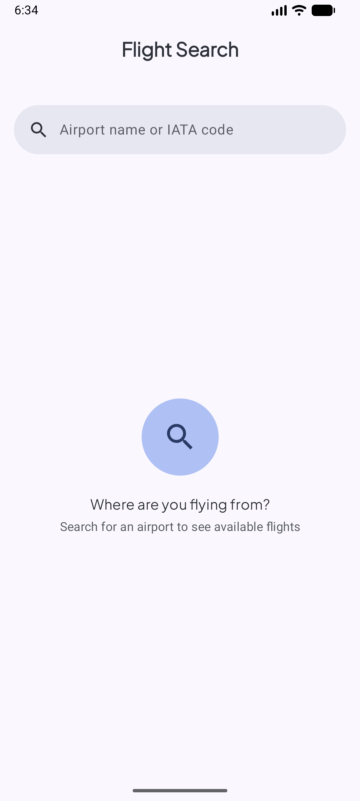
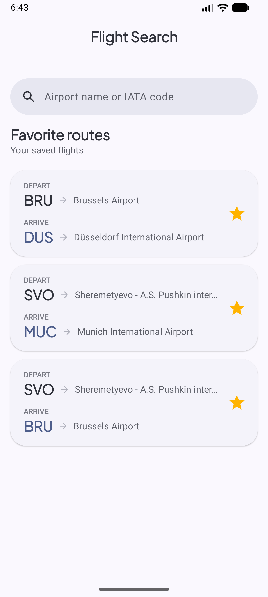
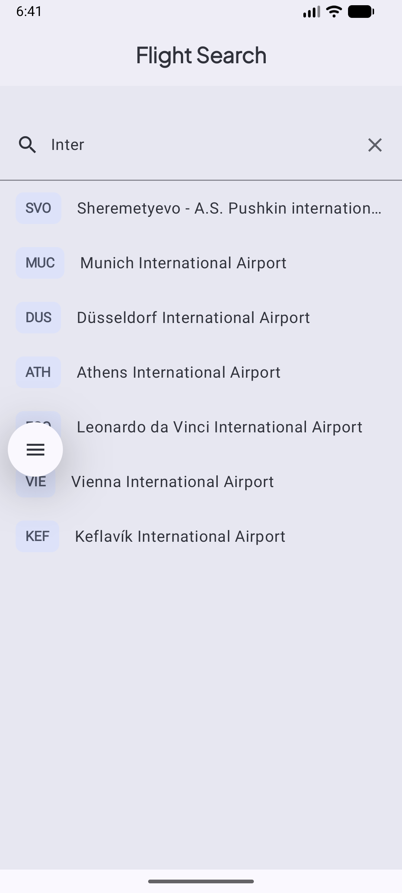
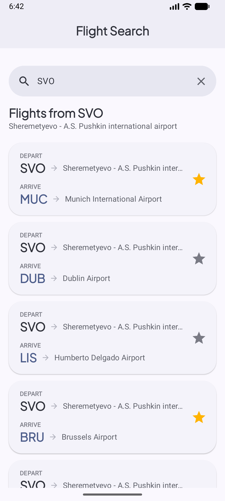

# Flight Search App

An Android app for searching airports and browsing available flights, with the ability to save routes to favorites. Built as part of Google's [Android Basics with Compose](https://developer.android.com/courses/android-basics-compose/course) course (project **Create a Flight Search app**).

The app works fully offline: all data lives in a local Room database pre-populated from an asset file.

**Source code:**
[Browse the app package on GitHub ](https://github.com/IlgarM4224/Flight-Search/tree/main/app/src/main/java/com/example/flightsearchapp)

## Screenshots

| Home (empty)                                                                                  | Home (favorites)                                                                                  |
|:----------------------------------------------------------------------------------------------|:--------------------------------------------------------------------------------------------------|
|           |        |

| Search                                                                                        | Search result                                                                                     |
|:----------------------------------------------------------------------------------------------|:--------------------------------------------------------------------------------------------------|
|                                 |                        |


## Features

- **Search-as-you-type suggestions** — find airports by IATA code or name (partial match), sorted by annual passenger traffic.
- **Flights from the selected airport** — every possible destination except the departure airport itself, from busiest to least busy.
- **Favorite routes** — add or remove a route by tapping the star; the star state updates instantly with a color animation.
- **Home screen with favorites** — with an empty query, all saved routes are shown; if there are none, an empty state is displayed.
- **Persistence** — favorites are stored in Room and survive app restarts.
- **Material 3** — light and dark themes, edge-to-edge layout, `SearchBar`, and `CenterAlignedTopAppBar` with `pinnedScrollBehavior`.

## Tech Stack

| Area         | Used                                                         |
|--------------|--------------------------------------------------------------|
| Language     | Kotlin                                                       |
| UI           | Jetpack Compose, Material 3                                  |
| Architecture | MVVM, unidirectional data flow (UDF)                         |
| Concurrency  | Kotlin Coroutines, Flow, StateFlow                           |
| Database     | Room (pre-populated DB via `createFromAsset`)                |
| Lifecycle    | `ViewModel`, `collectAsStateWithLifecycle`                   |
| DI           | Manual DI via `AppContainer` and `ViewModelProvider.Factory` |

## Architecture

The app is split into two layers: **data** and **ui**.

```
com.example.flightsearchapp
├── FlightSearchApplication.kt      # Application class, holds AppContainer
├── MainActivity.kt                 # Entry point, edge-to-edge, theme
├── data
│   ├── Flight.kt                   # Entities: Airport, Favorite
│   ├── FlightDao.kt                # Room DAO (queries return Flow)
│   ├── FlightDatabase.kt           # RoomDatabase (singleton, createFromAsset)
│   ├── FlightRepository.kt         # Repository interface
│   ├── OfflineFlightRepository.kt  # DAO-backed implementation
│   └── AppContainer.kt             # Dependency container
└── ui
    ├── AppViewModelProvider.kt     # ViewModel factory
    ├── screens
    │   ├── FlightSearchApp.kt          # Screen: Scaffold, SearchBar, lists, empty state
    │   ├── FlightSearchAppViewModel.kt # Screen state and business logic
    │   └── FlightCard.kt               # Route card with a favorite button
    └── theme                       # Material 3 theme
```

### Key decisions

- **Stateless UI.** `FlightSearchApp` collects state from the ViewModel and passes it to `FlightSearchAppContent`, which has no ViewModel dependency — this keeps `@Preview` and testing simple.
- **Single `uiState`.** `StateFlow<FlightSearchUiState>` is built from the query text and search parameters using `combine` + `flatMapLatest`, so previous database subscriptions are cancelled automatically when the query changes.
- **Query in Compose snapshot state.** The search text is held in `mutableStateOf` and converted to a Flow with `snapshotFlow`. This ensures the `TextField` receives every change synchronously, without stale values resetting the cursor.
- **Lazy subscription.** `stateIn(SharingStarted.WhileSubscribed(5_000))` stops database work when the screen is not visible and survives configuration changes.
- **Load only what is needed.** The favorites list is loaded only on the home screen (empty query and no airport selected).
- **Stable keys in `LazyColumn`.** Each row has a unique `key`, giving correct animations and fewer unnecessary recompositions.

## Database

Data comes from the pre-populated `flight_search.db`, located in `assets/database/` and copied to the app's storage on first launch (`createFromAsset`). The on-device database file is named `flight_search_app.db`.

### `airport` table

| Column       | Type    | Description                     |
|--------------|---------|---------------------------------|
| `id`         | INTEGER | Unique identifier (primary key) |
| `iata_code`  | VARCHAR | 3-letter IATA code              |
| `name`       | VARCHAR | Full airport name               |
| `passengers` | INTEGER | Number of passengers per year   |

### `favorite` table

| Column             | Type    | Description                     |
|--------------------|---------|---------------------------------|
| `id`               | INTEGER | Unique identifier (primary key) |
| `departure_code`   | VARCHAR | IATA code for departure         |
| `destination_code` | VARCHAR | IATA code for destination       |

Flights are generated on the fly: for the selected airport, every other airport is shown as a destination, so no separate flights table is needed.

## Getting Started

1. Clone the repository:
   ```bash
   git clone https://github.com/IlgarM4224/Flight-Search/tree/main/app/src/main/java/com/example/flightsearchapp
   ```
2. Open the project in **Android Studio** (the latest stable version is recommended).
3. Wait for Gradle sync to finish.
4. Make sure `flight_search.db` is located in `app/src/main/assets/database/`.
5. Run the app on an emulator or a physical device (**Run ▶**).

> If you change the database schema, uninstall the app from the device before running again so Room re-copies the database from assets.

## What This Project Covers

- Room: DAOs, Flow-based queries, pre-populated database from assets.
- Building reactive UI state with `combine`, `flatMapLatest`, and `StateFlow`.
- Material 3 `SearchBar` and `ListItem`.
- Manual dependency injection and the repository pattern.
- Separating stateful and stateless composables.


Created for educational purposes based on Google's Android Basics with Compose course.
